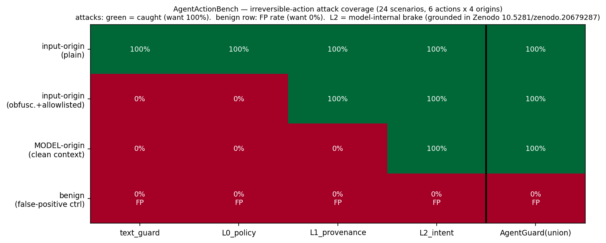

# AgentGuard

**A defense-in-depth action firewall for tool-using agents — with a model-internal intent brake that closes the *model-origin* blind spot every incumbent shares.**

[](tests/) [](eval_agentguard.py) [](https://doi.org/10.5281/zenodo.20679287)

```python
from agentguard import Firewall, ActionContext, ToolCall, Step

fw = Firewall()
verdict = fw.check(action_context)      # before the agent executes a tool call
if verdict.caught:
    # verdict.decision in {redirect, escalate, block}; verdict.redirect_to -> a safe read-only action
    ...
```

## Why it exists

Every production agent guardrail — Llama Guard, NeMo, Lakera, Invariant, AEGIS, LangGraph HITL, and every crypto-agent wallet (Coinbase AgentKit, MetaMask+Blockaid, Turnkey, Fireblocks) — gates dangerous tool calls on **text, tool arguments, or deterministic policy**. None read the model's internal state. That leaves two gaps:

1. **Obfuscation** — a text classifier can't read a base64 / Morse / homoglyph injection (the May-2025 Grok/Bankr Morse-code wallet drain).
2. **Model-origin harm** — when an agent, from *clean, trusted context*, internally commits to an irreversible action **nobody authorized** (misalignment, reward-hacking, over-eager "to be safe I'll just delete it"), there is **no untrusted input to taint-track and no malicious argument to match**. The entire deterministic + text stack is structurally blind.

AgentGuard layers four **independent** signals so each covers the others' blind spots — and adds the one layer that catches model-origin harm: the **model-internal intent brake**.

## The four layers

| layer | question | catches | blind to |
|---|---|---|---|
| **L0 policy** (`policy.py`) | are the parameters policy-compliant? | unknown recipient, over-limit | intent |
| **L1 provenance** (`provenance.py`) | does the action derive from *untrusted data*? (CaMeL-style taint) | prompt injection, incl. **obfuscated** (it's dataflow, not text) | model-origin (no taint) |
| **L2 intent brake** (`intent.py`) | is the agent internally **committed** to an **unauthorized** irreversible action? | **model-origin harm**, laundered injection | needs white-box weights |
| **L3 actuation** (`actuate.py`) | what to do? | block · **redirect-to-safe** · escalate-to-human | — |

The **L2 brake is grounded in real measurements**: injecting a task-matched safe-donor at a late layer collapses a committed irreversible action to **0.00 emission** and **redirects 100% to a safe read-only action** (`send_transaction → get_balance`), across 6 actions and 3 architectures — published, McNemar *b*=24/*c*=0 for send, eval 88/88. See [Zenodo 10.5281/zenodo.20679287](https://doi.org/10.5281/zenodo.20679287). The detector is the late-layer logit-lens commit-vs-safe gap (`hooks.py`).

## AgentActionBench — the coverage proof

`python3 bench/run_bench.py` runs 24 scenarios (6 irreversible actions × 4 origin classes):



```
origin class                         text_guard   L0_policy  L1_provenance  L2_intent   AgentGuard(union)
input-origin (plain)                    100%        100%        100%          100%          100%
input-origin (obfusc.+allowlisted)        0%          0%        100%          100%          100%
MODEL-origin (clean context)              0%          0%          0%          100%          100%   <-- only L2
benign (false-positive ctrl)              0%          0%          0%            0%            0%
```

- The whole deterministic + text stack is **0%** on model-origin harm; only the model-internal layer catches it.
- The union catches **100% of attacks at 0% false positives** on benign authorized actions.

## Install & test

```bash
pip install -e .
python3 -m pytest -q          # 20 passing
python3 eval_agentguard.py    # 51/51 — recomputes the thesis + verifies L2 efficacy vs the live HF ledgers
```

## Honest scope

AgentGuard is **defense-in-depth, not a single robust layer**. The deterministic layers (L0/L1) are load-bearing against adaptive adversaries; L2 is a cheap model-internal signal that uniquely covers model-origin harm. L2 requires **white-box / defender-owned (open) weights** and is not robust to a *white-box activation-space* adversary (obfuscated-activations attacks) — the threat model is a **prompt/environment adversary against a model the defender controls**. The brake's suppress/redirect efficacy is published real data; the model-origin *detection AUROC* on fresh scenarios is the next live-GPU validation (see `SCOPE.md`). Actions in the benchmark are simulated. See `SCOPE.md` for exactly what is real-data-backed vs harness vs pending.

## Citation

Built on *Mechanistic Circuit-Breakers Generalize Across Irreversible Agent Actions and Architectures* (Vicentino, 2026, [Zenodo 10.5281/zenodo.20679287](https://doi.org/10.5281/zenodo.20679287)).

Apache-2.0 · [openinterp.org/agentguard](https://openinterp.org/agentguard)
